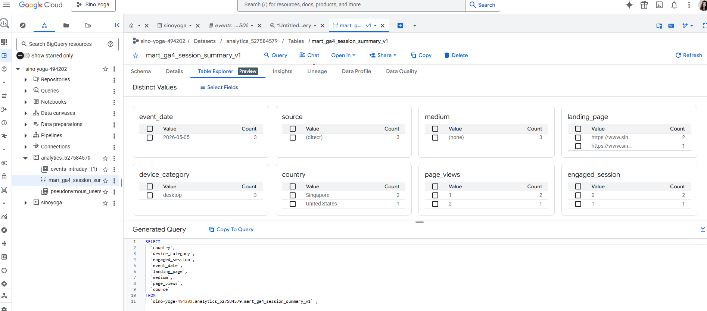
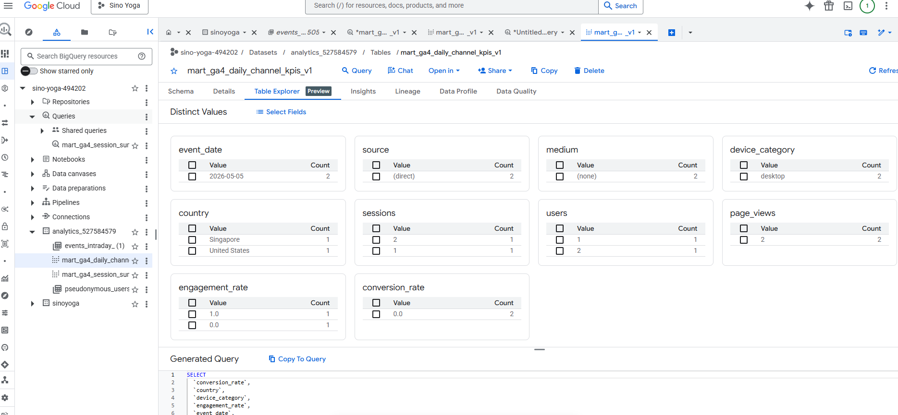
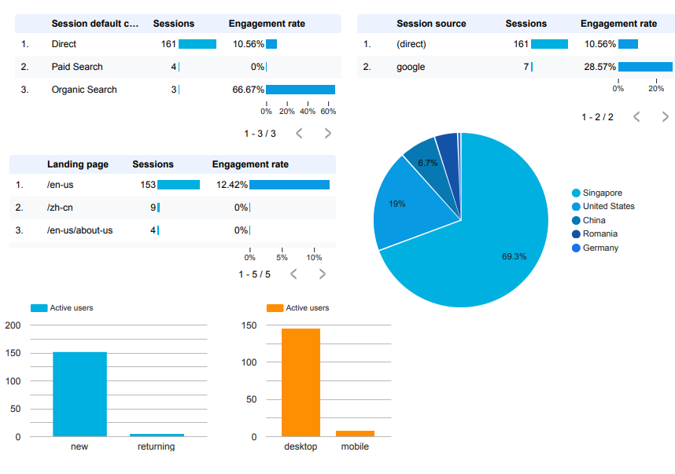

# 1. Business Context & Measurement Plan

## Client Overview

Sino Yoga is a cross-cultural yoga and wellness brand founded by Yang Qi, integrating Traditional Chinese Medicine with yoga practice through her signature Five-Element Meridian Yoga method. The brand is expanding from China into the U.S. market and uses YouTube (@Sinoyoga) as its primary discovery channel, with the long-term goal of monetizing its audience through tiered, subscription-based yoga memberships. Sino Yoga maintains a multi-platform digital presence across YouTube, WeChat, a newly launched Facebook page, and the [Sino Yoga website](https://sinoyoga.org/en-us).

## Business Objectives

::: callout-note
Sino Yoga's primary growth objectives shape the analytical scope of this engagement:
:::

-   Increase brand awareness across markets
-   Build a cohesive multi-channel platform experience
-   Grow subscriber base across YouTube and the website
-   Strengthen brand visibility in U.S. and international markets
-   Improve viewer retention and returning audience rate
-   Develop a sustainable monetization pathway

# 2.Descriptive Insights

## Data Source

Big Query data used linked from Google Analytics of the Sino Yoga Website. Also exported old GA4 data before linked to Big Query could occur since Big Query only shows events from when it was linked to GA4 only limited data available.

### Data Mart Purpose

This analytics mart supports Sino Yoga’s digital marketing dashboard by standardizing website and campaign KPIs for reporting in Looker Studio. The mart is designed to reduce repeated GA4 event-level queries and create consistent KPI definitions across the team.

#### **Business Questions / KPIs Supported**

This mart supports questions such as:

1.  How much website traffic is Sino Yoga receiving?

2.  Which channels drive the most sessions?

3.  Are users engaging with the website?

4.  Which landing pages perform best?

5.  Which devices and locations represent the strongest audience segments?

#### Big Query

#### **View 1: mart_ga4_session_summary_v1**

``` sql

CREATE OR REPLACE VIEW `sino-yoga-494202.analytics_527584579.mart_ga4_session_summary_v1` AS

WITH base_events AS (
  SELECT
    PARSE_DATE('%Y%m%d', event_date) AS event_date,
    user_pseudo_id,

    (
      SELECT value.int_value
      FROM UNNEST(event_params)
      WHERE key = 'ga_session_id'
    ) AS ga_session_id,

    event_name,

    (
      SELECT value.string_value
      FROM UNNEST(event_params)
      WHERE key = 'page_location'
    ) AS page_location,

    (
      SELECT value.int_value
      FROM UNNEST(event_params)
      WHERE key = 'engagement_time_msec'
    ) AS engagement_time_msec,

    traffic_source.source AS source,
    traffic_source.medium AS medium,
    traffic_source.name AS campaign,

    device.category AS device_category,
    geo.country AS country,
    geo.region AS region

  FROM `sino-yoga-494202.analytics_527584579.events_*`
)

SELECT
  event_date,
  user_pseudo_id,
  CONCAT(user_pseudo_id, '-', CAST(ga_session_id AS STRING)) AS session_key,

  COALESCE(source, '(direct)') AS source,
  COALESCE(medium, '(none)') AS medium,
  COALESCE(campaign, '(not set)') AS campaign,

  ANY_VALUE(page_location) AS landing_page,
  ANY_VALUE(device_category) AS device_category,
  ANY_VALUE(country) AS country,
  ANY_VALUE(region) AS region,

  COUNTIF(event_name = 'page_view') AS page_views,
  SUM(COALESCE(engagement_time_msec, 0)) / 1000 AS engagement_seconds,

  MAX(CASE 
    WHEN event_name IN ('sign_up', 'form_submit', 'purchase') THEN 1 
    ELSE 0 
  END) AS converted,

  MAX(CASE 
    WHEN COALESCE(engagement_time_msec, 0) > 0 THEN 1 
    ELSE 0 
  END) AS engaged_session

FROM base_events
WHERE ga_session_id IS NOT NULL
GROUP BY
  event_date,
  user_pseudo_id,
  session_key,
  source,
  medium,
  campaign;
```



#### **View 2: mart_ga4_daily_channel_kpis_v1**

``` sql

CREATE OR REPLACE VIEW `sino-yoga-494202.analytics_527584579.mart_ga4_daily_channel_kpis_v1` AS

-- Daily channel-level KPI table for Looker Studio
-- Aggregates session-level mart into reporting-ready KPIs

SELECT
  event_date,
  source,
  medium,
  campaign,
  device_category,
  country,

  COUNT(DISTINCT session_key) AS sessions,
  COUNT(DISTINCT user_pseudo_id) AS users,
  SUM(page_views) AS page_views,
  SUM(engagement_seconds) AS engagement_seconds,
  SUM(converted) AS conversions,
  SUM(engaged_session) AS engaged_sessions,

  SAFE_DIVIDE(SUM(engaged_session), COUNT(DISTINCT session_key)) AS engagement_rate,
  SAFE_DIVIDE(SUM(converted), COUNT(DISTINCT session_key)) AS conversion_rate,
  SAFE_DIVIDE(SUM(engagement_seconds), COUNT(DISTINCT session_key)) AS avg_engagement_seconds_per_session

FROM `sino-yoga-494202.analytics_527584579.mart_ga4_session_summary_v1`

GROUP BY
  event_date,
  source,
  medium,
  campaign,
  device_category,
  country;
```



## Data Studio Dashboard

<https://datastudio.google.com/reporting/8fb540f7-c90c-42e4-b9d8-a06a8e872fc6/page/NDKxF/edit>



### Key Insights from Studio Dashboard

The Studio dashboard provides a snapshot of Sino Yoga's website performance and shows that the site is still in an early growth stage with limited engagement.

#### Overall performance

#### Early Growth, Low Engagement

-   148 users = small but growing awareness

-   20 sec avg session + 89% bounce rate

    -   Users leave quickly = weak first impression & unclear value

#### Traffic & Acquisition Issues

Direct traffic dominates

-   Likely from YouTube/social, not scalable Low SEO & paid traffic

-   Poor discoverability = limited growth potential

#### **User Behavior Gaps**

-   Mostly new users (low retention)

-   Low interaction + no page exploration

```         
Weak engagement & unclear user journey
```

#### **Content & Funnel Problem**

-   /en-us = main entry page (almost all traffic)

-   Other pages barely visited

```         
No content flow → no conversion funnel
```

## KPI Logic & Controls

#### Core KPIs include:

-   Sessions

-   Users

-   Page views

-   Engagement rate

-   Average engagement time

-   Conversions

-   Conversion rate

### STAKEHOLDER Q1

> How do we increase visibility on the YouTube Channel and attract high-intent users?

| KPIs | Metric Definition | BreakDown | Data Source | Assumptions |
|---------------|---------------|---------------|---------------|---------------|
| Impressions | Number of times a video thumbnail is shown to users on YouTube, measures how often content is seen reach and visibility of videos | Traffic Source (Search, Browse, Suggested | YouTube Studio Analytics | Search Traffic= high intent users |
| Click-Through Rate (CTR) | CTR = (Clicks / Impressions x 100) Measuring how effectively titles/thumbnails drive clicks on videos | Video Title /Keyword & UTM | YouTube, GA4 & GTM | CTR reflects content packaging effectiveness |

### STAKEHOLDER Q2

> How can we build a cohesive yoga community that connects viewers across YouTube, our website to drive engagement and long-term growth?

| KPIs | Metric Definition | BreakDown | Data Source | Assumptions |
|---------------|---------------|---------------|---------------|---------------|
| Cross Platform Traffic (YouTube -\> Website) | Number of website sessions from YouTube | Traffic Source & UTM Parameters | YouTube & GTM | YouTube users represent core audience |
| Engagement Rate | Percentage of users who interact with content (likes, comments, & shares E= (total interactions/total views) x100 | Video Title /Keyword & UTDevice & Content Type | GA4 & YouTube | Engagement reflect active viewers |
| Returning Users | Percentage of users who return to the website or channel after first visit Returning Users Rate =(Returning users / Total Users) x100 | New users vs. Returning users | GA4 & YouTube | Returning users indicate stronger community engagement |

### STAKEHOLDER Q3

> How can we deepen engagement with our YouTube viewers and build enough value and trust for them to choose a paid membership?

| KPIs | Metric Definition | BreakDown | Data Source | Assumptions |
|---------------|---------------|---------------|---------------|---------------|
| Watch Time | Total time viewers watch videos(hrs) indicates depth of engagement & content value | video type & content type | YouTube Studio Analytics | Higher watch time indicate strong value & trust |
| Average View Durationgement Rate | Average time viewer spends watching video (AVD= Watch Time / Views) | video length & audience segment | YouTube Studio Analytics | engagement reflects active users with channel |
| Engagement Rate | Percentage of users who interact with content (likes, comments, & shares E= (total interactions/total views) x100 | video topic & CTA | YouTube Studio Analytics | users who engage & return frequently are more likely to convert to paying members |
| Conversion Rate | Percentage of engaged users who purchase a membership ((# memberships / users) x 100" | Traffic Source & User Journey Stage | GA4 & GTM | conversion tracking requires integration of mulitple platform |

# 3.Advanced Analysis

## Attribution Modeling Approach

-   Moves beyond descriptive insights to understand **how channels contribute across the user journey**

-   Uses **engaged sessions as a proxy for conversion**\
    *(due to lack of purchase/membership tracking in GA4)*

-   Recognizes that **user journeys are multi-touch**, not single-channel

-   Uses a **simplified path-based dataset** to approximate real user journeys

-   Evaluates **channel contribution across awareness, consideration, and engagement**

## Attribution Models Used

Four attribution approaches are applied to understand channel contribution across the funnel:

-   **First-Touch** -\> Awareness (first interaction)

-   **Last-Touch** -\> Conversion (final interaction)

-   **Linear** -\> Equal credit across journey

-   **Markov Chain** -\> Most impactful channels

## Key Insights from Attribution Analysis

-   **YouTube plays a critical awareness role**\
    Primary entry point for users, supporting initial discovery and brand exposure.

-   **Direct traffic dominates final interactions**\
    Many users return directly, suggesting that users revisit the site after initial exposure rather than converting immediately.

-   **Search and cross-channel interactions support mid-funnel behavior**\
    Channels such as Google Search appear within multi-step journeys, indicating that users seek additional information before engaging further.

-   **User journeys are multi-touch, not single-channel**\
    Engagement is driven by a combination of channels working together rather than a single source.

## Business Interpretation

These findings indicate that Sino Yoga’s current marketing funnel is:

-   Strong in **awareness generation**
-   Weak in **structured conversion pathways**

Evaluating performance using only last-touch attribution would underestimate the value of YouTube and other top-of-funnel channels. A multi-touch perspective shows that different platforms contribute at different stages of the user journey.

To improve performance, Sino Yoga should focus on:

-   Strengthening connections between YouTube and the website
-   Introducing clearer calls-to-action (CTAs)
-   Developing intermediate “bridge content” to guide users toward conversion

## Model Limitations

-   Path data is simulated and does not represent real user-level journeys
-   Cross-platform tracking is limited (e.g., YouTube to website attribution)

Despite these limitations, the analysis provides directional insights into how channels contribute to user engagement and highlights opportunities to improve the conversion funnel.

# 4.Recommendations & Limitations

## Recommendations

Six data-driven recommendations grounded in dashboard findings:

-   **Conversion Event Tracking** — implement signup, membership, and engagement events in GA4 (currently 0 tracked)
-   **Bounce Rate Reduction** — landing page optimization to address 89% bounce rate and 20-second sessions
-   **UTM Tracking Activation** — tag external links to surface YouTube, WeChat, and social referrals
-   **Returning Visitor Pathways** — email capture, content calendar, and retargeting for retention
-   **Multi-Page Content Journey** — strengthen internal links, embed videos, expand beyond `/en-us`
-   **Audience Localization** — prioritize the existing Singapore audience (70%) alongside U.S. growth

## Limitations

**Data Pipeline**

-   4-week reporting window — directional findings, not established trends
-   GA4 daily export still maturing
-   Mart-to-dashboard integration in progress

**Methodology**

-   Engagement used as proxy for conversion
-   Single-touchpoint dominance limits multi-touch attribution
-   Sample size of 148 users

**Scope**

-   Website-only analysis
-   No revenue or transactional data available

## Next Steps

**Measurement Foundation (Immediate)**

-   Add UTM-tagged website link to YouTube channel "About" page and top-performing video descriptions
-   Apply UTM tagging template to every new video at upload going forward
-   Reconnect the dashboard to the BigQuery mart for ongoing reporting

**Build Out the Pipeline (1–3 Months)**

-   Allow daily GA4 export tables to mature in BigQuery
-   Begin tracking cross-channel referral patterns through UTM data
-   Identify which YouTube content actually drives website traffic

**Strategic Iteration (3+ Months)**

-   Re-run attribution analysis with real multi-touch user paths
-   Evaluate which YouTube content categories drive the strongest website engagement
-   Use these insights to inform content strategy and any future website investments

## R Code Example Using Sino Yoga Journey Data

```{r}
library(tidyverse)
library(ChannelAttribution)
library(gt)
library(ggplot2)
library(scales)

# Example Sino Yoga attribution data
sino_paths <- tibble(
  user_id = c("U001", "U002", "U003", "U004", "U005", "U006", "U007", "U008"),
  path = c(
    "YouTube > Website > Direct",
    "Google Search > Website",
    "Facebook > YouTube > Website",
    "YouTube > Google Search > Website",
    "Direct > Website",
    "WeChat > YouTube > Website",
    "YouTube > Website",
    "Google Search > YouTube > Website > Direct"
  ),
  conversion = c(1, 0, 1, 1, 0, 1, 1, 1)
)

# Prepare data for ChannelAttribution package
channel_stack <- sino_paths |>
  group_by(path) |>
  summarise(
    conversion = sum(conversion),
    non_conversion = n() - sum(conversion),
    .groups = "drop"
  )

channel_stack
```

## First Touch Attribution

```{r}
first_touch <- sino_paths |>
  filter(conversion == 1) |>
  mutate(first_channel = str_trim(str_split_fixed(path, ">", 10)[,1])) |>
  count(first_channel, name = "conversions") |>
  mutate(
    attribution_model = "First Touch",
    credit_share = conversions / sum(conversions)
  )

first_touch |>
  gt() |>
  fmt_percent(columns = credit_share, decimals = 1) |>
  tab_header(
    title = "First-Touch Attribution",
    subtitle = "Which channels introduce converting users?"
  )
```

## Last- Touch Attribution

```{r}
last_touch <- sino_paths |>
  filter(conversion == 1) |>
  mutate(
    channels = str_split(path, ">"),
    last_channel = map_chr(channels, ~ str_trim(.x[length(.x)]))
  ) |>
  count(last_channel, name = "conversions") |>
  mutate(
    attribution_model = "Last Touch",
    credit_share = conversions / sum(conversions)
  )

last_touch |>
  gt() |>
  fmt_percent(columns = credit_share, decimals = 1) |>
  tab_header(
    title = "Last-Touch Attribution",
    subtitle = "Which channels close conversions?"
  )
```

## Linear Attribution

```{r}
linear_attr <- sino_paths |>
  filter(conversion == 1) |>
  mutate(channels = str_split(path, ">")) |>
  mutate(
    credit_table = map(channels, function(x) {
      x <- str_trim(x)
      tibble(
        channel = x,
        credit = 1 / length(x)
      )
    })
  ) |>
  select(credit_table) |>
  unnest(credit_table) |>
  group_by(channel) |>
  summarise(linear_credit = sum(credit), .groups = "drop") |>
  mutate(credit_share = linear_credit / sum(linear_credit))

linear_attr |>
  gt() |>
  fmt_number(columns = linear_credit, decimals = 2) |>
  fmt_percent(columns = credit_share, decimals = 1) |>
  tab_header(
    title = "Linear Attribution",
    subtitle = "Credit shared across the full journey"
  )
```

## Markov Chain Attribution

```{r}
#| message: false
#| warning: false
#| flg_pro: false
#| paged-print: false
markov_model_result <- markov_model(
  Data = channel_stack,
  var_path = "path",
  var_conv = "conversion",
  var_null = "non_conversion",
  out_more = TRUE
)

markov_results <- markov_model_result$result |>
  as_tibble() |>
  mutate(
    credit_share = total_conversions / sum(total_conversions)
  )

markov_results |>
  gt() |>
  fmt_number(columns = total_conversions, decimals = 2) |>
  fmt_percent(columns = credit_share, decimals = 1) |>
  tab_header(
    title = "Markov Chain Attribution",
    subtitle = "Channel contribution based on removal effect"
  )
```

## Interpretation

This attribution analysis in theory will helps Sino Yoga understand which channels support the full customer journey. YouTube may not always be the final conversion channel, but it likely plays a major role in awareness, education, and trust-building. The website may close the conversion, while Google Search or Direct traffic may reflect users returning after earlier exposure. Therefore, Sino Yoga should not judge performance only by last-touch conversions. Instead, it should use multi-touch attribution to understand how YouTube, search, website, and social platforms work together to move users toward membership.

# Appendix

Link to gitpages: <https://stephaniegutie63.github.io/Final-Client/>

Link to github repo: <https://github.com/StephanieGutie63/Final-Client>
