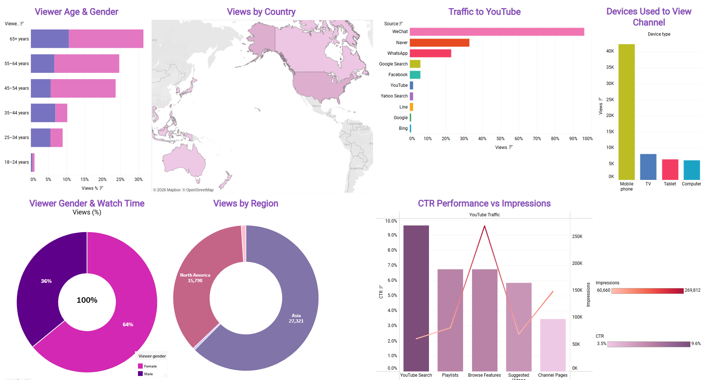

Below are selected projects that highlight my experience applying marketing analytics to real-world challenges. These projects reflect my ability to combine statistical tools, campaign data, and strategic thinking to inform decisions and drive results.

# 1.Student Performance Prediction Using Random Forest Modeling

## Overview

This project focused on analyzing factors that influence academic student performance using machine learning techniques. Using a Kaggle Student Performance dataset containing 10,000 student records, the goal was to predict student performance based on study habits, previous scores, extracurricular participation, sleep patterns, and practice exam completion. The project emphasized data cleaning, predictive modeling, and evaluating the effectiveness of machine learning algorithms in educational analytics.

### Tools Used

-   R Programming Language

### Methodology

-   Data cleaning and feature engineering
-   Exploratory data validation
-   Model training using Random Forest regression
-   Performance evaluation using RMSE, R², and MAE metrics

### Visualizations

The project included dataset summaries, variable structure analysis, and model evaluation metrics to interpret predictive performance. Statistical summaries and performance metrics were used to visualize the relationships between student behaviors and academic outcomes. The workflow also emphasized reproducibility and clean data practices through structured preprocessing and workflow pipelines in R.

# 2.Customer Retention Analysis Project

## Overview

This project focused on designing and executing a customer satisfaction and brand loyalty survey for a fictional regional coffee chain, *Bean There Done That*, to analyze declining repeat purchase behavior. The research aimed to identify how customer satisfaction, product quality, and price perceptions influence customer retention and revisit intentions. The project combined survey research methodology with statistical analysis to generate actionable managerial insights for improving customer loyalty and repeat visits.

### Learning Outcomes

-   Developed experience designing research-based surveys using marketing constructs and academic literature

<!-- -->

-    Strengthened understanding of customer satisfaction, brand loyalty, and consumer behavior analysis

<!-- -->

-    Learned how to apply quantitative research methods to real-world business problems

<!-- -->

-    Gained experience conducting regression analysis and Chi-Square testing using SPSS

<!-- -->

-    Improved ability to interpret statistical findings and translate them into business recommendations

<!-- -->

-    Enhanced understanding of how data-driven insights support customer retention strategies and decision-making

### Methodology

-   The project used a structured survey research methodology supported by academic journal references and conceptual frameworks related to customer satisfaction,product quality, price consciousness, and brand loyalty.
-   Survey responses from 200 generated participants were analyzed using SPSS through descriptive statistics, multiple regression analysis, ANOVA testing, cross-tabulation, and Chi-Square testing.

# 3.Sino Yoga Data Studio Project

## Overview

This project focused on analyzing Sino Yoga’s digital performance through an interactive analytics dashboard created in Google Data Studio (Looker Studio). The dashboard integrated website and YouTube performance metrics to evaluate audience engagement, search visibility, traffic behavior, and cross-platform growth opportunities. The primary objective was to assess how YouTube content contributed to website traffic, brand awareness, and customer engagement across digital channels

The project emphasized the importance of multi-channel integration and data-driven marketing strategies to support Sino Yoga’s long-term brand growth and monetization goals. Metrics such as website sessions, engagement trends, bounce rates, referral traffic, and audience interactions were analyzed to identify actionable insights for improving digital performance.

```{=html}
<iframe width="600" height="800" src="https://datastudio.google.com/embed/reporting/8fb540f7-c90c-42e4-b9d8-a06a8e872fc6/page/NDKxF" frameborder="0" style="border:0" allowfullscreen sandbox="allow-storage-access-by-user-activation allow-scripts allow-same-origin allow-popups allow-popups-to-escape-sandbox"></iframe>
```

# 4.Sino Yoga Analytical Objective

## Overview

Sino Yoga is a yoga and wellness brand that primarily broadcasts content through YouTube. Founded by Yang Qi, who has over 18 years of yoga expertise, the brand aims to expand its awareness and increase monetization opportunities through consistent digital growth and regular video uploads.

## Data

Using YouTube Studio Data as csv files while cleaning the data and creating a Tableau interactive link to show SEO Performance and overall channel visibility.

Data CSV Links:

### Tableau SEO Dashboard

As seen on this dashboard the audience is primarily 45 years and over females mainly from Taiwan dn the US. This strongly aligns with out clients goal of expanding to those target markets. That viewers are primarily using mobile devices to view the videos. This emphasizes the need to focus on mobile optimized content for all the videos. 

Regarding traffic to the YouTube channel, Sino Yoga relies largely on external traffic sources such as WeChat and Naver while YouTube & Google Search contribute to low traffic, indicating weak organic search visibility.

Inside of the YouTube platform traffic from vidoes shows CTR being 9-10% from Youtube search however the amount of times the video is shown or impressions are low compared to browse features traffic source. This suggest that while content performs well when discovered it lacks sufficient visibility in search results. 

[**Tableau Interactive Link**](https://public.tableau.com/views/Dashboard_17769899285630/Dashboard5?:language=en-US&:sid=&:redirect=auth&:display_count=n&:origin=viz_share_link)



### Time Series Plot

The time series plot shows the daily data of videos published regarding their impressions and over the channel's lifetime. Initially starting with high ctr and high impressions but stabilizing between 4-7% indicate incosistent visibility. While the ability to create effective thumbnails and title, there is a lack of consistency and uniformity in optimization. Impressions decreasing also show that there is a low visibility throughout the entire video uploads. 

[**Tableu Link to Interactive**](https://public.tableau.com/views/CTRofVideoPublished/Sheet1?:language=en-US&:sid=&:redirect=auth&:display_count=n&:origin=viz_share_link)

{style="border: none"}

### Keyword Research

The keyword analysis shows that while high-volume terms like yoga, health, and meditation drive the most search demand, they are highly competitive and difficult to rank for. In contrast, lower-competition keywords such as stretching, meridian, qi, and flexibility still offer meaningful search volume with a higher chance of ranking. This highlights a clear opportunity for Sino Yoga to shift toward **niche, lower-difficulty keywords**, enabling faster visibility in search and building stronger SEO performance over time. 

[**Tableu Interactive Link**](https://public.tableau.com/views/KeywordCompetition/Dashboard1?:language=en-US&:sid=&:redirect=auth&:display_count=n&:origin=viz_share_link)

{alt="Dashboard 1" style="border: none"}

```{=html}
<iframe src="RevealSlides.html" width="100%" height="600px">
</iframe>
```
